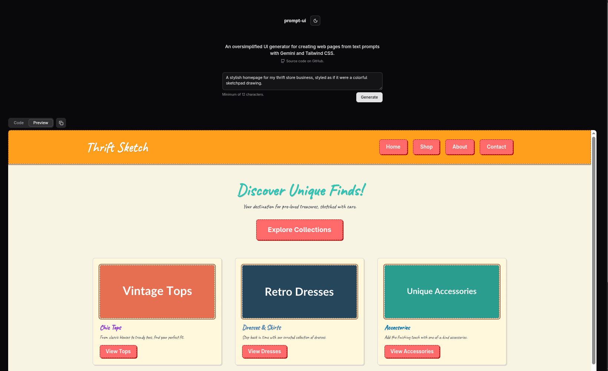

# prompt-ui

[prompt-ui.nize.ph](https://prompt-ui.nize.ph)

An oversimplified UI generator for creating web pages from text prompts with Gemini and Tailwind CSS.

Inspired by [v0](https://v0.dev/) and [draw-a-ui](https://github.com/SawyerHood/draw-a-ui). Built with SvelteKit, Tailwind CSS, shadcn-svelte and Vercel AI SDK.



## Quick Start

### Prerequisites

- Node.js (v18+)
- pnpm or npm
- [Google Generative AI API key](https://aistudio.google.com/api-keys)
  (navigate to https://aistudio.google.com/api-keys)

### Setup

1. Clone the repository:

   ```bash
   git clone https://github.com/dotnize/prompt-ui.git
   cd prompt-ui
   ```

2. Install dependencies:

   ```bash
   pnpm install
   ```

3. Create a `.env.local` file with your API key:

   ```env
   GOOGLE_GENERATIVE_AI_API_KEY=your_api_key_here
   ```

4. Start the development server:

   ```bash
   pnpm run dev
   ```

   Open [http://localhost:5173](http://localhost:5173) in your browser.

## Features

- 🤖 AI-powered UI generation using Google Gemini
- 🎨 Tailwind CSS styling with live preview
- 🌙 Dark/light theme support
- 📋 Code and preview tabs
- 📋 One-click copy to clipboard
- 🚀 Edge runtime deployment ready

## Development

### Available Commands

```bash
# Development
pnpm dev        # Start dev server
pnpm build      # Build for production
pnpm preview    # Preview production build

# Code Quality
pnpm lint       # Lint and format check
pnpm format     # Format code with Prettier
pnpm check      # TypeScript type check
pnpm check:watch # Watch mode for type checking

# UI Components
pnpm ui         # shadcn-svelte CLI for adding components

# Dependencies
pnpm deps       # Check for updates
pnpm deps:major # Check for major updates
```

## Project Structure

- `src/routes/` - SvelteKit routes and pages
  - `+page.svelte` - Main UI with prompt input
  - `api/chat/+server.ts` - AI endpoint (Edge runtime)
- `src/lib/components/` - Reusable components
  - `Preview.svelte` - Code/Preview tab interface
  - `ui/` - shadcn-svelte components
- `src/app.css` - Tailwind configuration and base styles

## Technology Stack

- **Framework**: SvelteKit + Vite
- **Styling**: Tailwind CSS v4 (via `@tailwindcss/vite`)
- **UI Components**: Bits UI
- **AI**: Google Generative AI (Gemini) via Vercel AI SDK
- **Deployment**: Vercel (`@sveltejs/adapter-vercel`)

## Deployment

This project is configured for Vercel deployment:

1. Push your code to a Git repository (GitHub, GitLab, etc.)
2. Import the project in [Vercel](https://vercel.com)
3. Add the `GOOGLE_GENERATIVE_AI_API_KEY` environment variable
4. Deploy

## Contributing

Contributions are welcome! Feel free to open an issue or submit a pull request.

## License

[MIT](./LICENSE)
